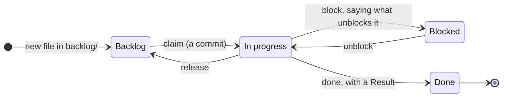
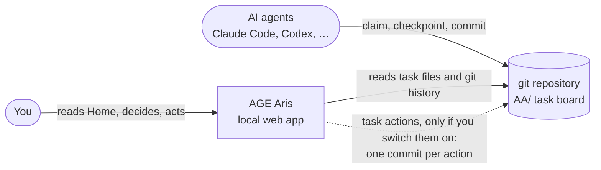

<p align="center">
  
</p>

# AGE Aris

A local project-management app for teams where some of the workers are AI
agents.

The task board lives **in git**, as one Markdown file per task in an `AA/`
folder. People and agents pick up work, report progress and hand it over by
committing to that folder. No server has to be running, and no two sessions
have to be awake at the same time. AGE Aris reads the board and the git history
behind it and shows you three things: what needs you, how work is flowing, and
whether the work follows the method the board sets.

- **Runs on your machine.** Node.js 22 and git. No npm dependencies, no
  accounts, no cloud.
- **Everything is a commit.** Every task, claim, status change and agent step
  is in git, so any number on screen can be traced to the commits behind it.
- **The method is the product.** Work-in-progress limits, claims, checkpoints,
  stale claims and service levels are shown and checked, using their own names.

## Quick start

```sh
git clone -b feature/pm-cockpit https://github.com/adervark/AGEAris.git
cd AGEAris
npm start
```

The app is on the `feature/pm-cockpit` branch until it is merged; `main`
holds only the `aa-init` plugin.

Open the sign-in link it prints, `http://127.0.0.1:4310/?token=…`, then choose
**Explore a sample project** to get six weeks of simulated history to look
around in. The [ten-minute tour](#a-ten-minute-tour) below walks through it.

> [!WARNING]
> If the `claude` CLI is on your `PATH`, **Run with agents** uses real Claude
> models on your account. In the Implement stage they run with
> `--dangerously-skip-permissions`, so they can run any command you can. To try
> the pipeline offline, open **Agents → Pipeline agents**, switch the Claude
> agents off and switch the **Rehearsal agent** on.

## How the workflow works

### The board is a folder

Each task is a Markdown file with its goal, steps, decision rules, handoff and
result. **The folder a file is in is its state.**

```text
AA/
  backlog/       ideas and registered work. No owner, free to reorder or drop.
  tasks/         committed work: in progress or blocked. Counts against the WIP limit.
  tasks/done/    delivered, or deliberately dropped. A "no" is a result too.
  checkpoints/   one append-only trail per running task (T012.jsonl)
  STATE.md       the board: a hand-written NOW note plus a generated table
  AA.yml         this project's WIP limit, stale threshold and what counts as a "spend"
  RULES.md       the protocol, one page, the same in every repository
```

### A task's life



| Step | Who | What lands in git | What AGE Aris shows |
|---|---|---|---|
| **Add** | person or agent | a new file in `backlog/` | the task in Backlog |
| **Claim** | the operator, through an agent or AGE Aris | the file moves to `tasks/` with an owner line, in one commit | In progress; WIP goes up; the age clock starts |
| **Work** | the claim holder | commits, plus checkpoint lines: `doing` *before* anything costly, `did` after, `end` on stopping | the holder's latest note; **stale** if nothing is heard within the stale threshold |
| **Block / unblock** | the claim holder | `status: blocked` and a one-line `blockedReason:` | Blocked, and an entry under **Needs you** |
| **Done** | the claim holder | the file moves to `tasks/done/` with its `## Result` | Done; cycle time and throughput update |

The rules that keep this honest, in full in [`AA/RULES.md`](AA/RULES.md):

- **A claim is a commit.** If two agents claim the same task, the second gets a
  merge conflict. That is by design.
- **Work in progress is limited.** When the board is at its limit, the next move
  is to finish or release something, not to start something new.
- **Decision rules come before a spend.** Anything you can't undo, or would pay
  for twice (a push, a migration, a long agent run), needs pass/fail criteria
  written into the task first.
- **Checkpoint before you spend.** If a session dies, its trail still says
  what was in flight, so the next one doesn't redo it.
- **The handoff stays current.** A task's `## Handoff` is kept true while it is
  claimed, so anyone can resume it cold.
- **The board is generated.** `AA/board.sh --write` renders `STATE.md` from
  the task files and git, and `--check` fails when it is stale.

### Who does what



There are three ways to use AGE Aris. They work the same way and differ in
where the board lives:

1. **Your own projects.** *Start a new project here* gives each project its own
   git repository in AGE Aris's data folder. You add, edit and drag tasks in
   the app, and every change is a commit.
2. **A repository your agents already work in.** *Track an existing repository*
   points AGE Aris at a repository that has an `AA/` board. Agents keep working
   there as usual, and AGE Aris reads their commits. It changes nothing there
   unless you switch on [task actions](#task-actions-on-a-tracked-board) for
   that repository. With them on, claim, release, block, unblock and done are
   each one commit on a branch you pin. To give a repository a board, install
   the `aa-init` skill ([plugin guide](docs/PLUGIN.md)) and run `/aa-init` in
   it.
3. **The agent pipeline.** On your own projects, **Run with agents** carries a
   task through stages, with a person approving at the gates:

   ```mermaid
   flowchart LR
       T[Triage] --> P[Plan] --> G1{{You approve}} --> I[Implement] --> R[Review] --> G2{{You approve}} --> V[Verify] --> D([Done])
       R -. "fails" .-> I
       V -. "fails" .-> I
   ```

   Each stage goes to the agent with the best measured record for that kind of
   work. Every prompt, output and approval goes into a hash-chained audit log
   committed to git. See [the pipeline guide](docs/PIPELINE.md).

### Your day with it

1. Open **Home**. **Needs you** lists what is waiting on a person, grouped by
   what it breaks: runs waiting at a gate, overdue work, stale claims, aging
   work, blocked work. **Since your last visit** says what moved.
2. Open a task from there. The drawer shows its state, who holds it, their
   latest note, and a timeline with the commit behind every change.
3. Act: approve or send back a pipeline run, move a task, or unblock someone.
4. If a number surprises you, click it. **Explain** shows how it was computed,
   which tasks it counted and which it left out, and the commits behind them.

## A ten-minute tour

1. `npm start`, open the sign-in link, and choose **Explore a sample project**.
   Its history is simulated and labelled as such everywhere.
2. **Home**: read **Needs you** and the project card with its health in words
   ("On track", "Watch", "Needs attention").
3. Open the project. Look at **Board**, then **Threads** (tasks by what they
   build on), **List**, **Flow** (throughput, cycle time, WIP, charts) and
   **Method** (the workflow, its policies, and which tasks break which check).
4. Click any number, a cycle time or a WIP count, to open **Explain**.
5. Drag a task from In progress to Done, or open it and change its status.
   The move is a commit in the project's own repository, under
   `.agesight-data/projects/`. (The sample sits at its WIP limit on purpose,
   so it refuses new work in progress until something finishes.)
6. Try the pipeline on a project of your own. Choose **Start a new project
   here**, add a task, open it and choose **Run with agents**. With the
   Rehearsal agent (see the warning above), each stage takes seconds. The run
   stops twice under **Needs you**: after Plan and after Review. Approve both
   times and the task reaches Done, with every step committed.
7. Optional: track a real board. Clone this repository a second time somewhere
   else (`git clone -b feature/pm-cockpit … aris-board`), choose **Track an
   existing repository**, and give it that clone's path. AGE Aris tracks its
   own development on an `AA/` board, so this shows a real project's history.

Ideas and bugs are welcome as GitHub issues.

---

*The rest of this page is reference: every view, the pipeline, tracking a
repository, storage, and development.*

## Home, projects, agents, activity

AGE Aris treats the way a project works as the product: work moves through
states, policies govern each move, and the method's checks say whether the work
follows them. Views use the method's own terms (WIP, cycle time, service level,
aging WIP, stale claim), and each one carries a line of plain meaning where it
appears.

**Home** is the first page, the view a project owner reads each morning:

- **Needs you**, grouped by what it breaks: decisions waiting on runs, overdue
  work, stale claims (agent claims with no commit or checkpoint within the
  stale threshold), dates at risk, aging WIP (in progress longer than the
  service level), blocked work, and urgent work in progress with no owner. Each
  item appears once, under its most pressing reason, with the holder's latest
  note. Checks with nothing to report fold into one "All clear" line.
- **Projects**: one card per project with its health in words (On track, Watch,
  Needs attention, or a grey label when history is too thin), the failing
  checks in one sentence, throughput against a usual week with a four-week
  sparkline, WIP, cycle time, service level, and agent sessions at work.
- **Since your last visit**: what finished, started, was blocked or unblocked,
  added, dropped, reopened, or slipped. Each count expands into its tasks. The
  window can also be the previous working day, 24 hours, or 7 days. **Mark
  seen** starts the next window from now. Leaving Home after ten seconds also
  does this. The last visit is kept in this browser only.

A project opens on its **Board** under a status line and four numbers:
throughput, WIP against its limit, cycle time, and service level. Cards carry
the same signal badges as Home (stale, aging, blocked, overdue) and the
holder's latest note. Done shows the newest ten of what finished this week and
says how many more there are; **Show all** expands it. **Threads** organises
tasks by what they build on, read from each task file's `depends:` line: a
thread is a task and everything filed under it. Threads with open work come
first, each showing its open tasks and the tasks they build on, with finished
steps folded. A long chain stays in one column and only a branch indents; a
task that needs more than one other task sits under the first and notes the
rest. An open task whose dependency is not done is marked **Waiting on** that
task, here, on its card, and in its drawer, which also lists what it builds on
and what builds on it. **List** groups tasks by state, one line each (on
narrower screens a task's signals sit under its title). **Flow** holds every
flow measure (throughput, usual week, WIP, cycle and lead time with their 85%
levels, blocked time, repeat slips), labeled charts, the risk and load tables,
and the git history the numbers were computed from. **Method** shows the
workflow and the policy behind each move, the health rules H2–H8 as named
method checks with the tasks that break each, the agent claim → checkpoint →
done protocol with its stale threshold, the pipeline's stages and gates (own
projects), and a tracked board's own `WORKFLOW.md`, `RULES.md`, `AGENTS.md`,
and `WHY.md`, rendered read-only.

Every number is a button. It opens the **Explain** drawer with the definition,
formula, clock, sample size, settings, the items counted, what was left out and
why, and the commits or audit events each item comes from. The definitions are
in [docs/METRICS.md](docs/METRICS.md).

A task opens in one drawer, whatever the page: its state, holder, signals, and
latest note; for a tracked repository, the task file as written; and its
timeline, with checkpoints folded and each change's commit. Tasks of your own
projects are edited there.

**Agents** lists the agent sessions holding work now, with what they hold,
their latest note, and whether their claim has gone stale. **Pipeline agents**
holds the agents the pipeline routes stages to and their record per role.
**Activity** shows one row per task per day (for example, Backlog → In
progress → Done); expanding a row lists each raw change with its commit. It
filters by kind and project. **All tasks** (from Projects) and search span the
workspace.

Timezone, working days, and the personal work-in-progress limit are read from
`<data dir>/settings.json` (`{"timezone": "Europe/London", "workdays": [1,2,3,4,5],
"personalWipLimit": 3}`). Ages and approval times skip non-working days.

The page refreshes every 10 seconds while visible; Home's brief every 30.
Refreshing pauses while a project or task editor is open, preserving the edit
in progress. The refresh button also loads changes immediately. The live
indicator changes to Reconnecting if the server becomes unavailable.

Drag a task to another column of one of your own projects, or open it and
choose a status. Use search (`/`) and owner, priority, or status filters to find
work. Old `#today`, `#overview`, `#tasks`, `#work`, `#changes`, and `#activity`
links open Home, All tasks, and Activity.

## Agent pipeline

Open a task and choose **Run with agents**. The task moves through stages,
Triage, Plan, Implement, Review, and Verify by default. For each stage AGE Aris
picks the agent with the best measured record for that kind of work. It stops
for your approval after Plan and Review. Home's **Needs you** lists every run that is
waiting on you. From there you can approve, request changes, send work back to
an earlier stage, choose or exclude an agent, edit an output, take a stage
over, pause, cancel, or retry.

Every prompt, output, routing decision, and approval is written to a
hash-chained audit log in the project's repository and committed to git. The
run page verifies the chain and every stored artifact.

AGE Aris registers an offline **Rehearsal agent** on first start. If the
`claude` CLI is installed, it also registers Claude Haiku, Sonnet, and Opus.
In the Implement stage these run with `--dangerously-skip-permissions`: they
can run any command your account can, without asking. Every other stage is
text-only, and Implement starts only after you approve the plan. Agents can
also be any local command, or an external process that pulls work over the
API using the token in `.agesight-data/.api-token`. Stages, gates,
retry policy, routing, the audit format, and the API are described in
[the pipeline guide](docs/PIPELINE.md).

## Track an existing repository

AGE Aris can watch a repository whose agents already keep an AA task board
(`AA/`, or `deaddrop/` or `pm/`, its older names). Choose **Track an existing
repository** and give the repository's folder. Home, health, changes, and each
task's history come from the board's files and the repository's git history.
Tasks change in the repository, where its agents work, and AGE Aris picks the
changes up. Nothing there changes from AGE Aris until you switch task actions
on for it (below).

- The folder must be the top of a git repository with a `.git` directory
  (worktrees and submodules cannot be tracked yet) and contain `AA/tasks/`,
  `deaddrop/tasks/` or `pm/tasks/`.
- Older boards without a `backlog/` folder are read as they are: a task in
  `tasks/` whose status is `open` or empty counts as backlog until it is
  claimed. Renaming the board folder, from `deaddrop/` to `AA/` say, keeps each
  task's history.
- The work in progress limit comes from the board's `AA.yml` (`deaddrop.yml` on
  an older board).
- Task files AGE Aris cannot read are listed on the project page instead of
  hiding the project.
- The full edit form, adding tasks, the pipeline, and agent runs are not
  available for a tracked repository. New tasks are added in the repository;
  AGE Aris acts on the tasks already there.
- **Stop tracking** removes AGE Aris's record of the repository and leaves the
  repository unchanged.

### Task actions on a tracked board

**Task actions** (claim, release, block, unblock, done) are off for every
tracked repository until you switch them on in its project header. The switch
shows what it means for that repository before you confirm:

- **The branch it pins.** Each action is one commit to the branch checked out
  when you switched on. While another branch is checked out, actions are
  refused; switching off and on again pins the current one.
- **Who commits.** Commits are authored as the repository's own git identity
  (`user.name`), carry the trailer `AGESight-Via: ui`, and are never pushed.
- **No hooks.** The commit is made with git plumbing under git's index lock:
  the repository's hooks, filters and signing do not run, and no script of the
  repository is run.
- **Other worktrees** do not see the commits until they merge.
- **STATE.md is left alone.** On a board with `board.sh`, run
  `AA/board.sh --write` after acting; on a board whose STATE.md is kept by hand,
  each commit names the board line that is now behind.

The choice is kept in AGE Aris's own `project.json`, in its data folder, never
in the repository. Starting AGE Aris with `AGESIGHT_TRACKED_WRITES=0` turns
task actions off for every tracked repository.

Each action changes one task file, its folder included, and nothing else in
the index or working tree. On a board with `backlog/`, claim moves the file
from `backlog/` to `tasks/` and release moves it back; on an older board
without one, both change the file in place. Done moves it to `tasks/done/` and,
when its `## Result` is still a placeholder, asks for one line to put there.
Only `status:`, `owner:`, `blockedReason:` and `## Result` are written; priority
and assignee do not exist on an AA board and stay disabled.

AGE Aris refuses an action, and changes nothing, when:

- task actions are off, or the board is in `deaddrop/` or `pm/` (rename it to
  `AA/` first);
- the repository is on another branch than the pinned one, or a merge, rebase
  or other operation is in progress, or git's index lock is held;
- git `user.name` is not set, or two task files claim the same id;
- another operator holds the task (AA rule 2);
- a checkpoint run on the task has not ended and wrote within `stale_hours`.
  The refusal names the run and the `AA/ckpt.sh log … end` line that reaps it
  if its session is gone;
- claiming would pass the WIP limit;
- the task file has uncommitted changes, is not committed yet, or changed
  while you acted.

Each refusal says what to do next, and AGE Aris also prints it to its own
stderr as one line. Some actions ask for a confirmation first, in one dialog
that lists every reason: a task held by one of your own agent sessions (with
its last sign of life), and runs that never ended or trail lines that do not
parse. A run that never ended is not reaped for you: the result names the
`AA/ckpt.sh` command to run.
Claim on a task one of your own agent sessions holds takes it back (AA rule
3): your owner line is written, with the agent's old line kept after it as
`; was …`. Other actions keep the agent's owner line.

**Done leaves the checkpoint trail in place.** AA's Done retires the trail
with `AA/ckpt.sh close <ID> --delete`; AGE Aris does not write trails or run
`ckpt.sh`, so a done on a task that has a trail reminds you to run that
command. This is a deliberate deviation from the board's Done.

**What agents in the repository see.** While AGE Aris commits (normally tens
of milliseconds, at most 3 seconds) git's index lock is held, so an agent's
`git commit` or `git add` can fail once with "index.lock exists"; `ckpt.sh`
retries, and a bare git command should be retried. If AGE Aris dies while
holding it, `.git/index.lock` reads `agesight <nonce>` and is safe to delete
when AGE Aris is not running. An action that was interrupted is named on the
project page, and actions there are refused until you have checked it and
removed the marker it names.

Repositories using reftable refs, a sparse checkout, a split index, or a
detached HEAD, and task folders where hard links fail, cannot have task
actions switched on.

Scripts can do the same with the `X-AGESight-Token` header:
`POST /api/projects/link` with `{"path": "/absolute/path", "name": "optional"}`
returns the project, and `DELETE /api/projects/<id>` stops tracking it.

## Storage and behavior

AGE Aris was first called AGESight. Names that are part of stored data or of
integrations keep that name so existing workspaces and scripts keep working:
the `AGESight-Via` commit trailer, the `X-AGESight-Token` API header, the
`.agesight-data` folder, the `AGESIGHT_*` environment variables, and the
`@agesight/web` claim on owner lines.

The first version manages local project repositories under
`.agesight-data/projects/<project-id>/`. Each project contains:

```text
project.json                  project settings
AA/STATE.md                   a generated task table and preserved NOW notes
AA/AA.yml                     work in progress policy
AA/backlog/                   unstarted Markdown tasks
AA/tasks/                     in progress and blocked tasks
AA/tasks/done/                completed tasks
AA/checkpoints/               agent checkpoint format
pipeline/pipeline.json        the project's stages (after the first edit)
pipeline/runs/R001/           one run: events.jsonl audit log, RUN.md, attempts/
.git/                         project history
```

A tracked repository's folder holds only `project.json`, which records the
repository's path, its board folder, and whether task actions are on and which
branch they pin. `.agesight-data/tracked-inflight/` holds a marker while a task
action on a tracked repository is being written, so an interrupted one is
settled, or named, when AGE Aris starts again.

Agents are registered in `.agesight-data/registry/agents.json`, a separate git
repository. Agents start in `.agesight-data/workdirs/` unless configured
otherwise. `.agesight-data/.api-token` holds the local API token.

The task's directory determines its state. Creating, editing, or moving work
records a commit in that project's repository; a task action on a tracked
repository records one commit there, on its pinned branch. Nothing is
automatically pushed to a remote. Task and project saves reject stale versions rather than overwrite
changes made since an editor opened. Blocked work counts toward the work in
progress limit. Unchanged saves add no commit. Every metric is computed from
that git history (first-parent, with commit times clamped so they never go
backwards) and from the runs' audit logs, so any number can be traced to the
commits behind it.

Project repositories are independent of the application's source repository.
The data directory is ignored by this repository's git configuration. Back up
that directory, including each project's `.git`, to retain work and history.

Choose another data directory or port when starting:

```sh
AGESIGHT_DATA_DIR=/path/to/workspace PORT=4400 npm start
```

The server listens on `127.0.0.1`. This release uses one local operator, with the
git identity configured on the machine. Named task owners are planning metadata;
agent claim ownership is recorded separately in the task frontmatter.

## Development

```sh
npm run check
npm test
```

Tests exercise persistence, state transitions, git history, work limits, stale
edits, validation, generated state preservation, HTTP requests, the audit
chain, agent routing, and pipeline runs end to end. Tests use local stand-in
agents and never call a model. HTTP tests
skip only if the environment prohibits listening on a local port.

The application uses Node's built-in HTTP server and a browser-native frontend.
The visual direction and scope are recorded in [DESIGN.md](DESIGN.md).

```text
server.mjs                    local HTTP server and API
lib/workspace.mjs             project/task persistence and policy
lib/pipeline.mjs              pipeline engine: runs, stages, runners, human actions
lib/router.mjs                performance-based agent routing
lib/agents.mjs                agent registry
lib/audit.mjs                 hash-chained audit log
agents/rehearsal-agent.mjs    offline stand-in agent
public/                       Home, board, Flow, Method, task drawer, and styles
tests/                        integration tests
skills/aa-init/               existing agent task-board integration
```

## Agent plugin

The existing `aa-init` plugin remains available for scaffolding task boards
into other repositories. Its installation and protocol documentation are in
[the plugin guide](docs/PLUGIN.md).

## License

UNLICENSED. All rights reserved by the author.
